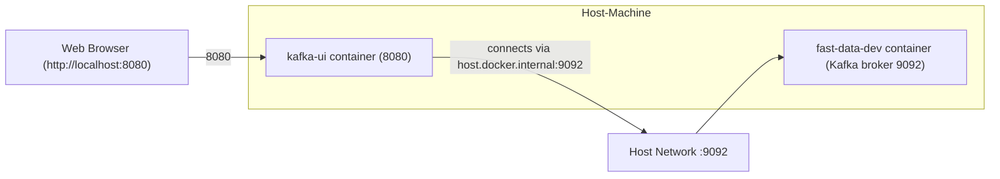

# Install 
```bash
docker run --rm -d --name kafka-ui \
       --add-host=host.docker.internal:host-gateway  \
       -p 8080:8080 \
       -e DYNAMIC_CONFIG_ENABLED=true \
       provectuslabs/kafka-ui
       
docker run --rm -d --name=fast-data-dev \
  --add-host=host.docker.internal:host-gateway \
  -p 9092:9092 -p 8081:8081 -p 8083:8083 -p 3030:3030 \
  -e ADV_HOST=host.docker.internal \
  -e ADV_PORT=9092 \
  lensesio/fast-data-dev
```
# Connect 

Open http:localhost:8080 
Add Broker: "host.docker.internal:9092"


